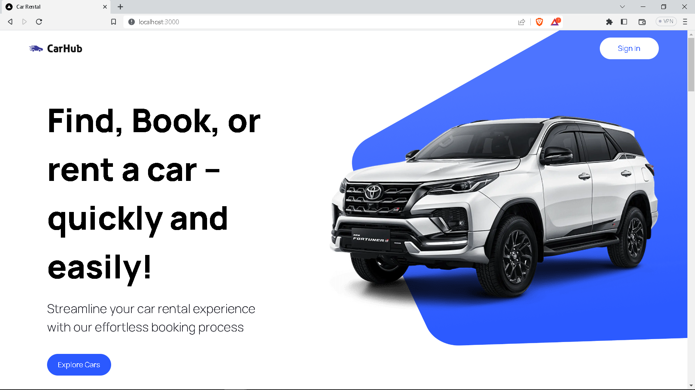
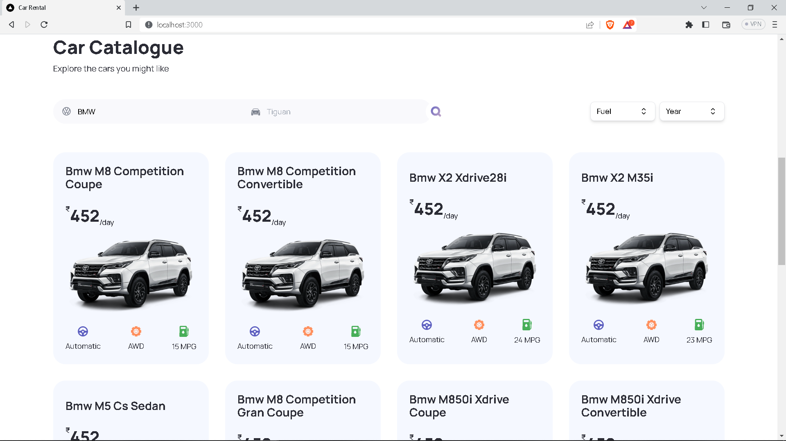
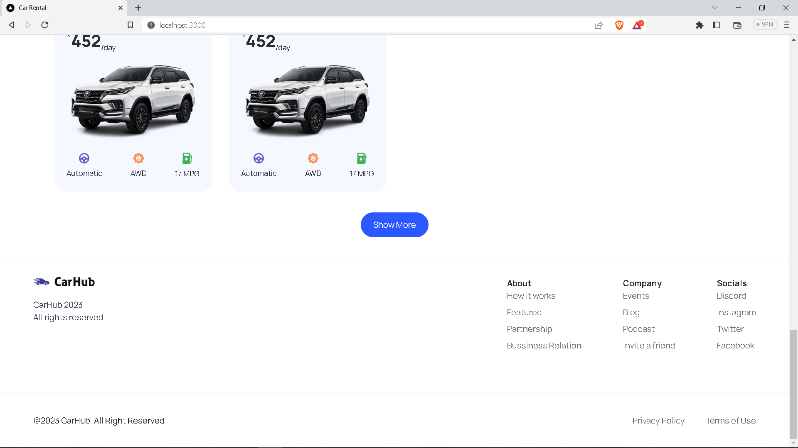

# Full Stack Car Rental with Next.js 13, Typescript, and Tailwind

#### https://sushil-car-rental.vercel.app

### Features:
 
- Rent cars online
- Filter cars with a brand name, model, year, and fuel type.
- Pop-up modal to see car details
- Tailwind design
- Tailwind animations and effects
- Full responsiveness








### Prerequisites

**Node version 14.x**

### Cloning the repository

```shell
git clone https://github.com/iprime2/AI-SAAS
```

### Install packages

```shell
npm install
```

### Setup .env file

```

```
 
### Setup Prisma

```shell
npx prisma generate
npx prisma db push
```

### Start the app

```shell
npm run dev
```

## Available commands

Running commands with npm `npm run [command]`

| command         | description                              |
| :-------------- | :--------------------------------------- |
| `dev`           | Starts a development instance of the app |
| `lint`          | Check any javascript error               |
| `build`         | To build the webapp                      |
